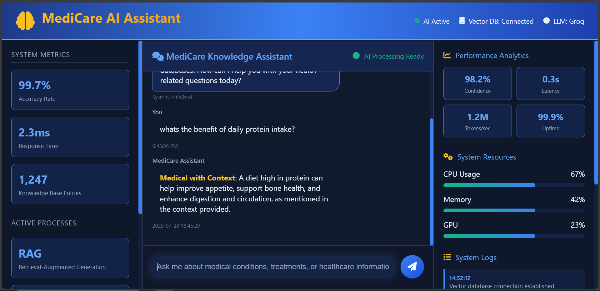
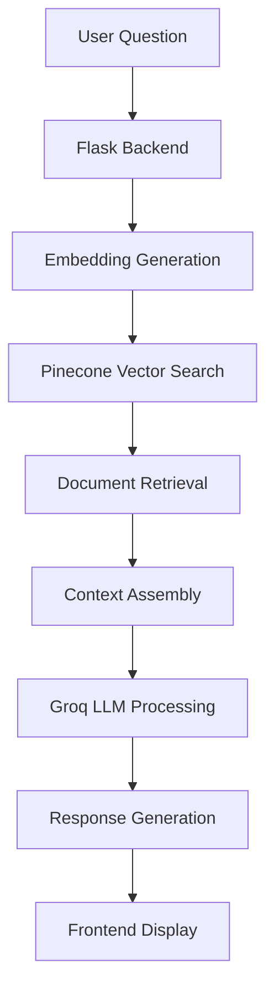

# 🏥 MediCare AI - Intelligent Medical Knowledge Assistant

<div align="center">



**An advanced RAG-powered medical chatbot that provides intelligent healthcare information through sophisticated AI technology.**

[](https://python.org)
[](https://flask.palletsprojects.com)
[](https://langchain.com)
[](https://pinecone.io)
[](https://groq.com)

</div>

## 🌟 Overview

MediCare AI is a sophisticated medical knowledge assistant built using **Retrieval-Augmented Generation (RAG)** technology. It combines the power of large language models with a comprehensive medical knowledge base to provide accurate, contextual healthcare information.

### 🎯 Key Features

- **🧠 Advanced RAG Pipeline**: Utilizes cutting-edge retrieval-augmented generation for accurate responses
- **⚡ Lightning Fast**: Powered by Groq's `llama-3.1-8b-instant` for sub-second response times
- **📚 Medical Knowledge Base**: Trained on comprehensive medical literature and documentation
- **🎨 Professional UI**: Modern, responsive dashboard with real-time analytics
- **🔍 Intelligent Search**: Vector-based similarity search using Pinecone database
- **💬 Human-like Responses**: Contextual, empathetic communication style
- **🛡️ Safety First**: Built-in medical disclaimers and professional consultation recommendations

## 🚀 Technology Stack

| Component | Technology | Purpose |
|-----------|------------|---------|
| **Frontend** | HTML5, CSS3, JavaScript | Modern, responsive user interface |
| **Backend** | Flask (Python) | Web application framework |
| **LLM** | Groq (Llama-3.1-8B-Instant) | Large language model for generation |
| **Embeddings** | HuggingFace (all-MiniLM-L6-v2) | Text embedding generation |
| **Vector DB** | Pinecone | Vector storage and similarity search |
| **RAG Framework** | LangChain | Orchestrating the RAG pipeline |
| **Document Processing** | PyPDF, RecursiveCharacterTextSplitter | PDF parsing and text chunking |

## 📋 Prerequisites

- Python 3.8 or higher
- Groq API Key ([Get here](https://console.groq.com))
- Pinecone API Key ([Get here](https://pinecone.io))

## 🛠️ Installation

### 1. Clone the Repository
```bash
git clone https://github.com/yourusername/medicare-ai-chatbot.git
cd medicare-ai-chatbot
```

### 2. Create Virtual Environment
```bash
python -m venv venv

# Windows
venv\Scripts\activate

# macOS/Linux
source venv/bin/activate
```

### 3. Install Dependencies
```bash
pip install -r requirements.txt
```

### 4. Environment Setup
Create a `.env` file in the root directory:
```bash
GROQ_API_KEY=your_groq_api_key_here
PINECONE_API_KEY=your_pinecone_api_key_here
```

### 5. Setup Vector Database
Run the vector database setup script:
```bash
python vectore_store_db.py
```

## 🏃‍♂️ Running the Application

### Development Mode
```bash
python app.py
```

### Production Mode
```bash
python main.py
```

Access the application at: `http://localhost:8080`

## 💡 Usage

1. **Start the Application**: Run `python app.py`
2. **Open Browser**: Navigate to `http://localhost:8080`
3. **Ask Questions**: Type medical questions in the chat interface
4. **Get Responses**: Receive intelligent, contextual answers

### Example Queries
- "What are the symptoms of diabetes?"
- "How does hypertension affect the heart?"
- "What is the recommended treatment for pneumonia?"

## 🏗️ Architecture



### RAG Pipeline Flow

1. **Query Processing**: User question is received via Flask API
2. **Embedding Generation**: Question converted to vector using HuggingFace embeddings
3. **Similarity Search**: Top-3 relevant documents retrieved from Pinecone
4. **Context Assembly**: Retrieved documents combined with user question
5. **LLM Generation**: Groq model generates contextual response
6. **Response Delivery**: Formatted answer returned to user interface

## 📁 Project Structure

```
medicare-ai-chatbot/
├── app.py                 # Main Flask application
├── main.py               # Alternative entry point
├── vectore_store_db.py   # Vector database setup
├── requirements.txt      # Python dependencies
├── pyproject.toml       # Project configuration
├── .env                 # Environment variables
├── data/
│   └── Medical_book.pdf # Medical knowledge source
├── src/
│   ├── __init__.py
│   ├── loader.py        # Document loading utilities
│   └── prompt.py        # System prompts
├── templates/
│   └── index.html       # Frontend template
├── static/
│   └── style.css       # Additional styles
└── research/
    └── trials.ipynb     # Jupyter notebooks for experimentation
```

## ⚙️ Configuration

### Customizing the Knowledge Base
1. Replace `data/Medical_book.pdf` with your medical documents
2. Run `python vectore_store_db.py` to rebuild the vector database
3. Restart the application

### Modifying Response Behavior
Edit `src/prompt.py` to customize:
- Response style and tone
- Medical disclaimers
- Context handling rules

### Adjusting Retrieval Parameters
In `app.py`, modify:
```python
retriever = vector_store.as_retriever(
    search_type="similarity", 
    search_kwargs={"k": 3}  # Change number of retrieved documents
)
```

## 🔧 Troubleshooting

### Common Issues

**Issue**: `ValueError: Index 'medical-rag-project' not found`
- **Solution**: Update index name in `app.py` to match your Pinecone index

**Issue**: Missing environment variables
- **Solution**: Ensure `.env` file contains all required API keys

**Issue**: Memory errors during PDF processing
- **Solution**: Reduce chunk size in `src/loader.py`

## 🤝 Contributing

1. Fork the repository
2. Create a feature branch (`git checkout -b feature/amazing-feature`)
3. Commit your changes (`git commit -m 'Add amazing feature'`)
4. Push to the branch (`git push origin feature/amazing-feature`)
5. Open a Pull Request

## 📄 License

This project is licensed under the MIT License - see the [LICENSE](LICENSE) file for details.

## ⚠️ Disclaimer

**Important**: MediCare AI is designed for educational and informational purposes only. It should not be used as a substitute for professional medical advice, diagnosis, or treatment. Always consult with qualified healthcare professionals for medical concerns.

## 🙏 Acknowledgments

- **LangChain**: For the powerful RAG framework
- **Groq**: For lightning-fast LLM inference
- **Pinecone**: For efficient vector storage and search
- **HuggingFace**: For state-of-the-art embedding models
- **Medical Community**: For providing valuable knowledge sources

---

<div align="center">
  <p>Built with ❤️ for better healthcare information accessibility</p>
  <p>
    <a href="#-overview">Back to Top</a> •
    <a href="mailto:your.email@example.com">Contact</a> •
    <a href="https://github.com/yourusername/medicare-ai-chatbot/issues">Report Bug</a>
  </p>
</div>
